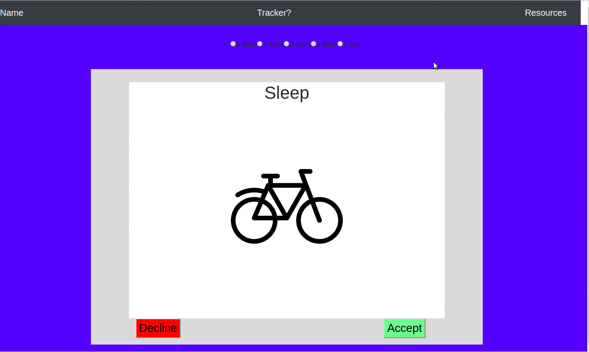

# Mental Health Application
An easy game of challenges in mindfulness, physical activity and other mental health reinforcers to help reduce stress and anxiety.  Overtime, watch your cultivation of healthy mental health habits.

## Getting Started
Swipe through the cards for a category and accept to reveal instructions. Do the activity in the suggested time and, when completed, press DONE.  You will score a star and your accomplishment will be recorded.  Try to do at least three activities per day.  

### Prerequisites
This application was built with ReactSwipe.JS, React.JS, Node.JS, MySQL, Sequelize, Chart.JS and other NPM packages.

### Installing

## Authors
  * Stephen Armstrong
  * Patricia Lee
  * Prashan Welipitiya
  * Gail Izaguirre

## Acknowledgments
  * Michael Bethencourt
  * Aylan Mello
  * Aileen Santos
  * Shani Burdette
  * UC Berkeley Extension

###### **(c)2018.  All Rights Reserved**
